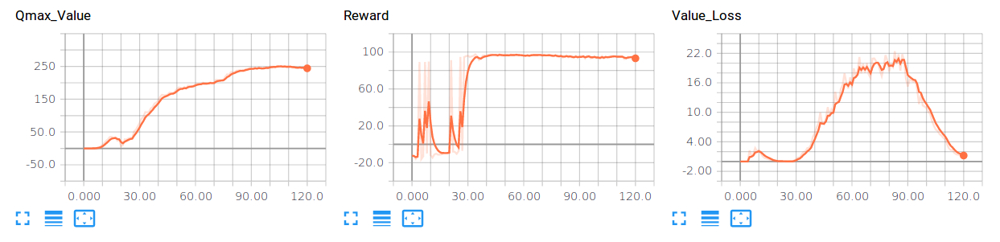

# Distributed-DDPG


## Overview

The purpose of this repository is to implement the Deep Deterministic Policy Gradient algorithm or [DDPG](https://arxiv.org/abs/1509.02971) in a distributed fashion as proposed [here](https://arxiv.org/abs/1704.03073).

I will start by evaluating the performance of DDPG in simple cases and then comparing this performance when distributing the training process among several "workers".

## MountainCarContinuous-v0 (OpenAI)

<table>
  <tr>
    <td></td>
  </tr>
</table>

I evaluated the performance of the standard DDPG approach on the [MountainCarContinuous](https://github.com/openai/gym/wiki/MountainCarContinuous-v0) task. The figure below shows the training curves until the problem is considered solved.



The provided results were obtained by running a single worker. To replicate the results run the following commands in two different consoles:

  ```
  # Parameter server
  python ddpg.py --job_name="ps" --task_index=0
  ```

  ```
  # First worker
  python ddpg.py --job_name="worker" --task_index=0
  ```

  To visualize the training process using TensorBoard:

  ```
  # TensorBoard
  tensorboard --logdir=results/tboard_ddpg/
  ```
